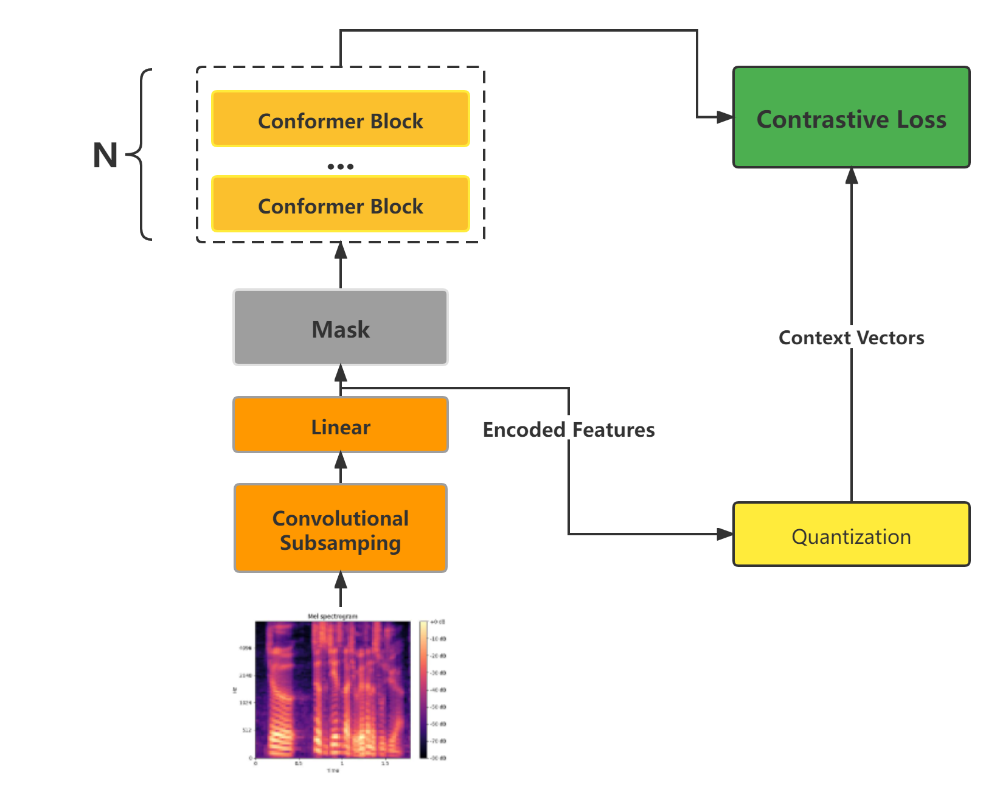

## Conformer-based wav2vec2.0
unofficial implements model architecture like [Pushing the Limits of Semi-Supervised Learning for Automatic Speech Recognition](https://arxiv.org/abs/2010.10504v1)
### model architecture

### Train a new model
#### Prepare training data manifest
example scripts for wenetspeech dataset to generate manifest and vocab
```bash
bash scripts/wenetspeech/prepared_data.sh
```
```
├── dev.ltr  # 字粒度验证集
├── dev.phe # 拼音粒度验证集
├── dev.tsv # 验证集文件列表
├── dev.wrd # 词粒度验证集
├── dict.ltr.txt # 字粒度dict
├── dict.phe.txt  # 拼音粒度dict
├── lexicon.txt # 字到词的lexicon
├── test.ltr 
├── test.phe
├── test.tsv
├── test.wrd
├── train.ltr
├── train.phe
├── train.tsv
├── train.wrd
└── valid.tsv
```
### Train a connoformer based wav2vec 2.0 pretrain model
you can just run bash script
```bash
bash examples/conformer_based_wav2vec2/pretrain.sh
```

```bash
fairseq-hydra-train \
  +task.data=/path/to/data \
  common.tensorboard_logdir=/path/to/tensorboard \
  distributed_training.distributed_world_size=1 \
  optimization.update_freq=[24] \
  checkpoint.save_dir=/path/to/save/checkpoints \
  model._name=conformer_based_wav2vec2 \
  --config-dir   examples/conformer_based_wav2vec2/config/pretraining \
  --config-name   conformer_based_wav2vec2
```
**Note**: you can simulate 64 GPUs by using k GPUs and adding command line parameters (before --config-dir) distributed_training.distributed_world_size=k +optimization.update_freq='[x]' where x = 64/k
### Fine-tune a pre-trained model with CTC
you can just run bash script
```bash
bash examples/conformer_based_wav2vec2/finetuning.sh
```

```bash
fairseq-hydra-train \
    +task.data=/path/to/data \
    common.tensorboard_logdir=/path/to/tensorboard \
    distributed_training.distributed_world_size=1 \
    optimization.update_freq=[24] \
    checkpoint.save_dir=/root/data/Semi-Supervised-Speech-Recognize/chechpint/wenetspeech/finetuning \
    model.w2v_path=/root/data/Semi-Supervised-Speech-Recognize/chechpint/wenetspeech/checkpoint_best.pt \
    dataset.num_workers=2 \
    dataset.max_tokens=1200000 \
    --config-dir   /root/data/Semi-Supervised-Speech-Recognize/examples/conformer_based_wav2vec2/config/finetuning \
    --config-name  conformer_based_wav2vec2

```